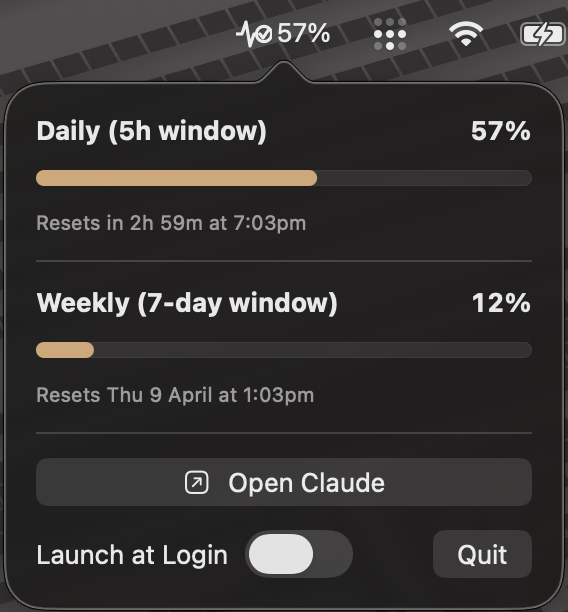

# PulseCheck

> macOS menu bar utility for monitoring Claude Code API usage limits in real time

**Claude Code doesn't surface your usage limits in the UI — PulseCheck fixes that.**

A native macOS menu bar app that displays your Claude Code usage percentage at a glance. Click the icon to see daily (5-hour) and weekly (7-day) usage with progress bars, reset countdowns, and a manual refresh button. Automatically refreshes expired OAuth tokens so it keeps working unattended.




## Features

- **Live usage percentage** in the menu bar with adaptive icon (auto-tints for light/dark mode)
- **Daily (5-hour) and weekly (7-day)** usage meters with progress bars
- **Reset countdown** for daily limit, date/time for weekly limit
- **Last-updated timestamp** showing when data was last fetched
- **Manual refresh button** to fetch usage on demand
- **60-second polling** with automatic exponential backoff on rate limits (429)
- **Automatic OAuth token refresh** — keeps working beyond the ~8-hour access token lifetime without user intervention
- **Launch at Login** toggle via SMAppService
- **Quick-launch button** to open the Claude desktop app
- **Zero configuration** — reads your existing Claude Code OAuth token from the macOS Keychain

## Tech Stack

| Component | Technology |
|-----------|-----------|
| Language | Swift 6.1 (strict concurrency) |
| UI | SwiftUI + AppKit (NSStatusItem + NSPopover) |
| Networking | URLSession async/await |
| Auth | macOS Keychain (Security framework) |
| Polling | Structured concurrency (Task.sleep) |
| Min target | macOS 14.0 (Sonoma) |

## Install

Requires macOS 14 (Sonoma) or later. Pick one:

---

### Option A: Homebrew (recommended)

```bash
brew install --cask captnjo/tap/pulsecheck
```

---

### Option B: Download DMG

**[Download PulseCheck-1.1.dmg](https://github.com/Captnjo/pulsecheck/releases/download/v1.1/PulseCheck-1.1.dmg)**

1. Open the downloaded DMG
2. Drag **PulseCheck** into your **Applications** folder
3. Launch PulseCheck from Applications
4. macOS will warn the app is from an unidentified developer — click **Cancel**, then:
   - Go to **System Settings > Privacy & Security**
   - Scroll down to the security section — you'll see "PulseCheck was blocked"
   - Click **Open Anyway** and confirm

---

### Option C: Build from source

Requires Xcode 16.3+.

```bash
git clone https://github.com/Captnjo/pulsecheck.git
cd pulsecheck
xcodebuild -project PulseCheck.xcodeproj -scheme PulseCheck -configuration Release build
```

Or open `PulseCheck.xcodeproj` in Xcode and hit Cmd+R.

To produce a DMG with drag-to-install: `./scripts/build-dmg.sh`

---

**Prerequisites:** [Claude Code](https://docs.anthropic.com/en/docs/claude-code) must be installed and authenticated (`claude auth login`). The app reads your existing login — no separate API key needed.

## How it works

PulseCheck reads Claude Code's OAuth credentials from the macOS Keychain (service: `Claude Code-credentials`) and polls the `/api/oauth/usage` endpoint every 60 seconds. No API key or manual setup is needed — it piggybacks on your existing Claude Code login.

When the access token expires (~8 hours), PulseCheck silently refreshes it using the OAuth `refresh_token` grant and stores the new credentials in its own Keychain item (`PulseCheck-claude-credentials`). Your original Claude Code credentials are never modified.

If you see "No credentials", run `claude auth login` in your terminal.

## Architecture

```
AppDelegate
 ├── StatusBarController (NSStatusItem + NSPopover)
 │    └── UsagePanelView (SwiftUI)
 └── UsageStore (@Observable, @MainActor)
      ├── CredentialsService (shadow-first Keychain read)
      │    └── KeychainService (read/write/delete shadow + read-only Claude Code)
      ├── AnthropicAPIClient (usage fetch + 403 scope-loss detection)
      └── TokenRefreshService (actor, Task-based dedup)
```

- **UsageStore** owns the polling loop and coordinates credential loading, API calls, and token refresh
- **CredentialsService** reads PulseCheck's shadow Keychain first, falls back to Claude Code's Keychain, and detects re-authentication (refreshToken mismatch)
- **TokenRefreshService** is a Swift actor that deduplicates concurrent refresh requests via a stored `Task` handle
- **AnthropicAPIClient** detects 403 scope-loss (Anthropic server bug) and routes to the auth recovery path

## License

[GPL v3](LICENSE) — free to use, modify, and distribute. Derivative works must also be open source under the same license.

## Contributing

Issues and PRs welcome. If you hit a bug or have a feature idea, [open an issue](https://github.com/Captnjo/pulsecheck/issues).
