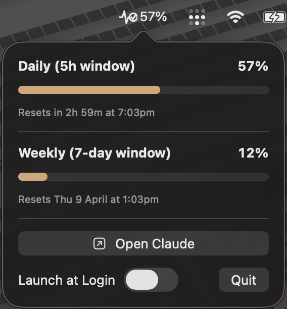

# PulseCheck

> macOS menu bar utility for monitoring AI coding tool usage limits in real time

**Claude Code doesn't surface your usage limits in the UI — PulseCheck fixes that. Now for Codex and OpenRouter too.**

A native macOS menu bar app that shows your usage at a glance. The dropdown panel has a tab per provider — Claude Code, Codex (ChatGPT plan limits), and OpenRouter (via opencode) — each with its own meters. The menu bar title always shows the most-constrained provider so you know instantly if you can keep working.




## Features

- **Menu bar title = worst-of across providers** — the number that actually limits you
- **Tabbed panel** with independent meters per provider:
  - **Claude Code** — daily (5h) and weekly (7d) % with reset countdowns
  - **Codex** — 5h and 7d ChatGPT-plan windows (read-only; never touches codex's tokens)
  - **OpenRouter** — $ daily/weekly/monthly spend via opencode's stored key, plus per-key limit when set
- **Token-safe by design** — only ever refreshes credentials it owns; never consumes another tool's refresh token
- **Last-updated timestamp** and manual refresh button
- **60-second polling** with automatic exponential backoff on rate limits (429)
- **Launch at Login** toggle via SMAppService
- **Zero configuration** — reads credentials the CLIs already have on disk

## Tech Stack

| Component | Technology |
|-----------|-----------|
| Language | Swift 6.1 (strict concurrency) |
| UI | SwiftUI + AppKit (NSStatusItem + NSPopover) |
| Networking | URLSession async/await |
| Auth | macOS Keychain (Security framework) |
| Polling | Structured concurrency (Task.sleep) |
| Min target | macOS 14.0 (Sonoma) |

## Install

Requires macOS 14 (Sonoma) or later. Pick one:

---

### Option A: Homebrew (recommended)

```bash
brew install --cask captnjo/tap/pulsecheck
```

---

### Option B: Download DMG

**[Download PulseCheck-1.3.dmg](https://github.com/Captnjo/pulsecheck/releases/download/v1.3/PulseCheck-1.3.dmg)**

1. Open the downloaded DMG
2. Drag **PulseCheck** into your **Applications** folder
3. Launch PulseCheck from Applications
4. macOS will warn the app is from an unidentified developer — click **Cancel**, then:
   - Go to **System Settings > Privacy & Security**
   - Scroll down to the security section — you'll see "PulseCheck was blocked"
   - Click **Open Anyway** and confirm

---

### Option C: Build from source

Requires Xcode 16.3+.

```bash
git clone https://github.com/Captnjo/pulsecheck.git
cd pulsecheck
xcodebuild -project PulseCheck.xcodeproj -scheme PulseCheck -configuration Release build
```

Or open `PulseCheck.xcodeproj` in Xcode and hit Cmd+R.

To produce a DMG with drag-to-install: `./scripts/build-dmg.sh`

---

**Prerequisites:** Providers appear automatically when their credentials exist on disk:
- **Claude Code** — installed and authenticated (`claude auth login`); read from the macOS Keychain
- **Codex** — logged in with ChatGPT (`codex login`, ChatGPT mode); read from `~/.codex/auth.json`
- **OpenRouter** — opencode authenticated with OpenRouter (`opencode auth login`); read from `~/.local/share/opencode/auth.json`

No API keys or manual setup — PulseCheck piggybacks on credentials the tools already have.

> **Note:** v1.3+ is not App-Store-sandboxed (it reads CLI credential files in your home directory). The binary is ad-hoc signed and talks only to `api.anthropic.com`, `chatgpt.com`, and `openrouter.ai`.

## How it works

PulseCheck reads each tool's existing credentials and polls its usage endpoint every 60 seconds:

| Provider | Credentials source | Usage API |
|----------|-------------------|-----------|
| Claude Code | macOS Keychain (`Claude Code-credentials`) | `api.anthropic.com/api/oauth/usage` |
| Codex | `~/.codex/auth.json` (ChatGPT OAuth) | `chatgpt.com/backend-api/wham/usage` |
| OpenRouter | `~/.local/share/opencode/auth.json` | `openrouter.ai/api/v1/key` |

**Token safety.** Refresh tokens rotate on every use — whoever consumes one invalidates the copy the other holder has. PulseCheck therefore never sends another tool's refresh token anywhere. It refreshes only credentials it obtained through its own earlier refresh calls (stored in its own Keychain item, `PulseCheck-claude-credentials`), and treats codex/opencode credentials as strictly read-only. If a provider's token goes stale, its tab shows **"Auth expired"** and it re-syncs the next time that tool runs.

If the Claude tab shows "not logged in", run `claude auth login` in your terminal.

## Architecture

```
AppDelegate
 ├── StatusBarController (NSStatusItem + NSPopover)
 │    └── UsagePanelView (SwiftUI, tabbed per provider)
 └── UsageStore (@Observable, @MainActor)
      ├── CredentialsService (shadow-first Keychain read, provenance-tracked)
      │    └── KeychainService (read/write/delete shadow + read-only Claude Code)
      ├── AnthropicAPIClient (usage fetch + 403 scope-loss detection)
      ├── TokenRefreshService (actor, token-keyed dedup, PulseCheck-owned tokens only)
      ├── CodexService (~/.codex/auth.json reader + wham/usage client, read-only)
      └── OpenRouterService (opencode auth.json reader + /api/v1/key client, read-only)
```

- **UsageStore** owns the polling loop and coordinates credential loading, API calls, and token refresh
- **CredentialsService** reads PulseCheck's shadow Keychain first, falls back to Claude Code's Keychain, tracks credential provenance (`claudeCode` vs `shadow`), and re-syncs when Claude Code holds newer credentials (compared by expiry)
- **TokenRefreshService** is a Swift actor that deduplicates concurrent refresh requests (keyed by refresh token) and is only ever invoked with PulseCheck-owned tokens
- **AnthropicAPIClient** detects 403 scope-loss (Anthropic server bug) and routes to the auth recovery path

## License

[GPL v3](LICENSE) — free to use, modify, and distribute. Derivative works must also be open source under the same license.

## Contributing

Issues and PRs welcome. If you hit a bug or have a feature idea, [open an issue](https://github.com/Captnjo/pulsecheck/issues).
