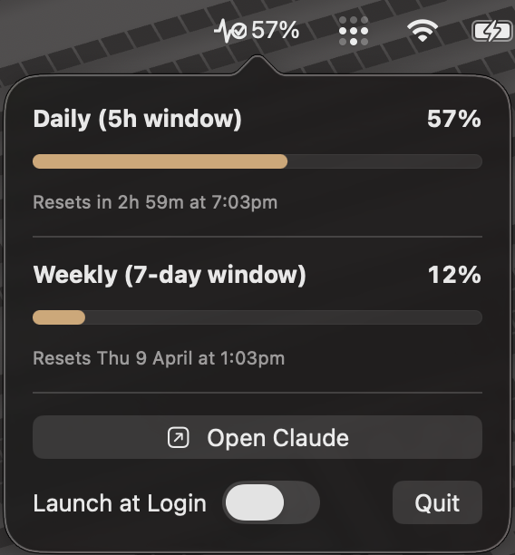

# PulseCheck

> macOS menu bar utility for monitoring AI coding tool usage limits in real time

**Claude Code doesn't surface your usage limits in the UI — PulseCheck fixes that. Now for Codex and OpenRouter too.**

A native macOS menu bar app that shows your usage at a glance. Click its menu bar icon to open a panel with a tab per provider — Claude Code, Codex (ChatGPT plan limits), and OpenRouter (via opencode) — each with its own meters. The menu bar is icon-only; usage percentages appear in the panel.




## Features

- **Icon-only menu bar** — click to view all three providers in one panel
- **Tabbed panel** with independent meters per provider:
  - **Claude Code** — five-hour and weekly (7d) % with reset countdowns
  - **Codex** — 5h and 7d ChatGPT-plan windows (read-only; never touches codex's tokens)
  - **OpenRouter** — $ daily/weekly/monthly spend via opencode's stored key, plus per-key limit when set
- **Token-safe by design** — only ever refreshes credentials it owns; never consumes another tool's refresh token
- **Last-updated timestamp** and manual refresh button
- **60-second polling** with automatic exponential backoff on rate limits (429)
- **Launch at Login** toggle via SMAppService
- **Zero configuration** — reads credentials the CLIs already store in Keychain or files

## Tech Stack

| Component | Technology |
|-----------|-----------|
| Language | Swift 6.1 (strict concurrency) |
| UI | SwiftUI + AppKit (NSStatusItem + NSPopover) |
| Networking | URLSession async/await |
| Auth | macOS Keychain (Security framework) |
| Polling | Structured concurrency (Task.sleep) |
| Min target | macOS 14.0 (Sonoma) |

## Install

Requires macOS 14 (Sonoma) or later. Pick one:

---

### Option A: Homebrew (recommended)

```bash
brew tap captnjo/tap
brew trust captnjo/tap   # one-time: acknowledges you trust this tap (Homebrew 6+)
brew install --cask captnjo/tap/pulsecheck
```

> **Why the trust step?** Homebrew 6 warns "untrusted tap" for every third-party tap added over HTTPS — trust is a per-user, local decision, and this repo is no exception. Review the [cask source](https://github.com/Captnjo/homebrew-tap/blob/main/Casks/pulsecheck.rb) (it just downloads the DMG below and verifies its SHA-256) and run `brew trust captnjo/tap` once. Upgrades then work normally with `brew upgrade --cask pulsecheck`.

---

### Option B: Download DMG

**[Download PulseCheck-1.4.4.dmg](https://github.com/Captnjo/pulsecheck/releases/download/v1.4.4/PulseCheck-1.4.4.dmg)**

1. Open the downloaded DMG
2. Drag **PulseCheck** into your **Applications** folder
3. Launch PulseCheck from Applications
4. macOS will warn the app is from an unidentified developer — click **Cancel**, then:
   - Go to **System Settings > Privacy & Security**
   - Scroll down to the security section — you'll see "PulseCheck was blocked"
   - Click **Open Anyway** and confirm

---

### Option C: Build from source

Requires Xcode 16.3+.

```bash
git clone https://github.com/Captnjo/pulsecheck.git
cd pulsecheck
xcodebuild -project PulseCheck.xcodeproj -scheme PulseCheck -configuration Release build
```

Or open `PulseCheck.xcodeproj` in Xcode and hit Cmd+R.

To produce a DMG with drag-to-install: `./scripts/build-dmg.sh`

---

**Prerequisites:** Providers appear automatically when their credentials are available:
- **Claude Code** — installed and authenticated (`claude auth login`); read from the macOS Keychain or `~/.claude/.credentials.json`
- **Codex** — logged in with ChatGPT (`codex login`, ChatGPT mode); read from `~/.codex/auth.json`
- **OpenRouter** — opencode authenticated with OpenRouter (`opencode auth login`); read from `~/.local/share/opencode/auth.json`

No API keys or manual setup — PulseCheck piggybacks on credentials the tools already have.

> **Note:** v1.3+ is not App-Store-sandboxed (it reads CLI credential files in your home directory). The binary is ad-hoc signed and talks only to `api.anthropic.com`, `chatgpt.com`, and `openrouter.ai`.

## How it works

PulseCheck reads each tool's existing credentials and polls its usage endpoint every 60 seconds:

| Provider | Credentials source | Usage API |
|----------|-------------------|-----------|
| Claude Code | macOS Keychain (`Claude Code-credentials`), with credentials-file fallback | `api.anthropic.com/api/oauth/usage` |
| Codex | `~/.codex/auth.json` (ChatGPT OAuth) | `chatgpt.com/backend-api/wham/usage` |
| OpenRouter | `~/.local/share/opencode/auth.json` | `openrouter.ai/api/v1/key` |

**Token safety.** Refresh tokens rotate on every use — whoever consumes one invalidates the copy the other holder has. PulseCheck therefore never sends another tool's refresh token anywhere. It refreshes only credentials it obtained through its own earlier refresh calls (stored in its own Keychain item, `PulseCheck-claude-credentials`), and treats codex/opencode credentials as strictly read-only. If a provider's token goes stale, its tab shows **"Auth expired"** and it re-syncs the next time that tool runs.

**Claude credential discovery.** PulseCheck enumerates references to matching Keychain items, reads each password individually, and selects the freshest decodable credentials by expiry. It also checks `~/.claude/.credentials.json` (or the directory specified by `CLAUDE_CONFIG_DIR` in the app's environment) and uses whichever Claude Code store has newer credentials. An unreadable or malformed duplicate does not prevent a readable item from being used.

**v1.4.4 fixes a false "not logged in" error in v1.4.3.** The earlier duplicate-item query requested all password data at once, which macOS rejects with error `-50`. The individual reads fix that query without changing Claude Code's credentials. If Claude still appears logged out, check `claude auth status` before signing in again with `claude auth login`. Safe diagnostic logs help distinguish Keychain access failures from decoding failures. See [release notes](CHANGELOG.md).

### Keychain prompts

On first launch macOS may ask for access to Claude Code's Keychain items — choose **Always Allow** to grant ongoing access (*Allow* grants a single read). If duplicate items exist, each may require its own grant. PulseCheck reads Claude Code's stores when it needs credentials or checks for newer credentials during authentication recovery.

Two things can make a prompt reappear:
- **App updates** — grants are bound to the app's code signature; this build is ad-hoc signed, so each new version asks once more. Click **Always Allow** again. A stable Developer ID signature removes this.
- **Manual grant** — you can pre-grant standing access in **Keychain Access → login → "Claude Code-credentials" → Access Control → "Always allow access by these applications" → add PulseCheck**.

The Codex and OpenRouter tabs never trigger Keychain prompts — they read plain files.

## Architecture

```
AppDelegate
 ├── StatusBarController (NSStatusItem + NSPopover)
 │    └── UsagePanelView (SwiftUI, tabbed per provider)
 └── UsageStore (@Observable, @MainActor)
      ├── CredentialsService (shadow-first Keychain read, provenance-tracked)
      │    └── KeychainService (read/write/delete shadow + read-only Claude Code)
      ├── AnthropicAPIClient (usage fetch + 403 scope-loss detection)
      ├── TokenRefreshService (actor, token-keyed dedup, PulseCheck-owned tokens only)
      ├── CodexService (~/.codex/auth.json reader + wham/usage client, read-only)
      └── OpenRouterService (opencode auth.json reader + /api/v1/key client, read-only)
```

- **UsageStore** owns the polling loop and coordinates credential loading, API calls, and token refresh
- **CredentialsService** reads PulseCheck's shadow Keychain first, falls back to Claude Code's Keychain and credentials file, tracks credential provenance (`claudeCode` vs `shadow`), and re-syncs when Claude Code holds newer credentials (compared by expiry)
- **TokenRefreshService** is a Swift actor that deduplicates concurrent refresh requests (keyed by refresh token) and is only ever invoked with PulseCheck-owned tokens
- **AnthropicAPIClient** detects 403 scope-loss (Anthropic server bug) and routes to the auth recovery path

## License

[GPL v3](LICENSE) — free to use, modify, and distribute. Derivative works must also be open source under the same license.

## Contributing

Issues and PRs welcome. If you hit a bug or have a feature idea, [open an issue](https://github.com/Captnjo/pulsecheck/issues).
